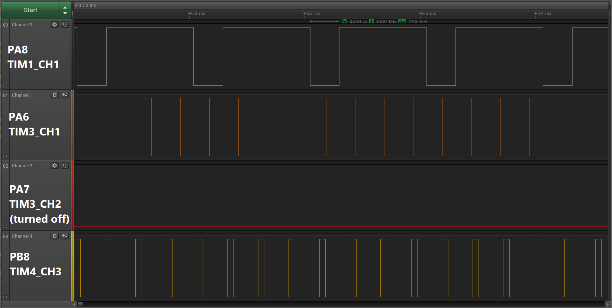

# CH32VX PWM PIO Library
 A CH32V/X PWM library for the PlatformIO NoneOS-SDK, utilizing the MCU's timers. It is based on the PWM_Output example, provided by [OpenWCH](https://github.com/openwch).

# Note
- The actual PWM frequency might differ from the specified frequency by various offsets, due to integer division.
- To find out which Timer and Channel correspond to the pin of an MCU model (e.g. TIMx_CHx), consult the MCU's datasheet. 
    - Specifying timer, channel and pin wrong might cause unwanted behaviour.
    - Make sure that the pins specified for the PWM are not already in use by other parts of your code.
    - Theoretically, the same timer that is used in the PWM, can be used for other applications, with the same frequency.

# Installation
## Prequisites
You need to have PlatformIO VSCode Plugin with the [WCH CH32V](https://github.com/Community-PIO-CH32V/platform-ch32v) Platform installed.

## Setup
Simply clone this repository onto your computer and open the folder like a regular PlatformIO project. You can try out the example in ```main.c```, if you have a CH32V203C8T6-EVT-R0 at hand. (Utilizes the [CH32V USB Serial Library](https://github.com/KingKoro/CH32VX-USB-Serial-PIO-Library))

Alternativly, you can also copy the library ```lib/CH32V_PWM``` into any PIO project, modify your ```platformio.ini``` if needed and import the library into your ```main.c``` with: 
```c
#include "ch32v_pwm.h"
```

# Usage

Import ```ch32v_pwm.h```, then initialize a PWM handler struct with ```init_pwm()```, set the duty cycle with ```set_pwm_dutycycle()``` and enable the PWM output with ```enable_pwm_output()```.  Make sure to always pass a pointer to the PWM handler object as the first argument.

Now you can compile and upload the project.

## Overview

The available functions are:
```C++
int init_pwm(PWM_handle *object, uint8_t iTimer, uint8_t iChannel, int iPin, uint32_t iF_base, uint16_t iCount = 254, uint16_t iPwm_mode = PWM_MODE2)    /* Initialize struct */

void set_pwm_dutycycle(PWM_handle *object, uint16_t duty)           /* Set duty cycle of struct */

void enable_pwm_output(PWM_handle *object)                          /* Enable PWM output of struct */
void disable_pwm_output(PWM_handle *object)                         /* Disable PWM output of struct */

```

# Example

This example shows how to create a PWM output on 3 different pins (PA8, PA6 and PB8 on CH32V203), each with different frequencies (~10kHz, ~20kHz and ~40kHz). They all output a Duty Cycle of roughly 50% with 8-Bit resolution.

```C
#include "ch32v_pwm.h"

int main(void)
{
    // ---------- Initialization Code ----------
    NVIC_PriorityGroupConfig(NVIC_PriorityGroup_1);
    SystemCoreClockUpdate();
    Delay_Init();

    // Initialize PWM on PA8 (TIM1_CH1) with 10kHz Base frequency
    PWM_handle PWM_A8={0};
    init_pwm(&PWM_A8, PWM_TIM1, PWM_CH1, 0xA8, 10000);
    set_pwm_dutycycle(&PWM_A8, 191);              // set  PWM duty cycle to ~75% (191/255) initially, setting dutycycle automatically starts PWM output
    // Initialize PWM on PA6 (TIM3_CH1) with 20kHz Base frequency
    PWM_handle PWM_A6={0};
    init_pwm(&PWM_A6, PWM_TIM3, PWM_CH1, 0xA6, 20000);
    set_pwm_dutycycle(&PWM_A6, 128);              // set  PWM duty cycle to 50% (128/255) initially, setting dutycycle automatically starts PWM output
    // Initialize PWM on PA7 (TIM3_CH2) with 20kHz Base frequency
    PWM_handle PWM_A7={0};
    init_pwm(&PWM_A7, PWM_TIM3, PWM_CH2, 0xA7, 20000);
    set_pwm_dutycycle(&PWM_A7, 128);              // set  PWM duty cycle to 50% (128/255) initially, setting dutycycle automatically starts PWM output
    disable_pwm_output(&PWM_A7);                  // Disable output, demonstrate independant channels
    // Initialize PWM on PB8 (TIM4_CH3) with 40kHz Base frequency
    PWM_handle PWM_B8={0};
    init_pwm(&PWM_B8, PWM_TIM4, PWM_CH3, 0xB8, 40000);
    set_pwm_dutycycle(&PWM_B8, 51);              // set  PWM duty cycle to ~20% (51/255) initially, setting dutycycle automatically starts PWM output


    // ---------- Endless Loop Code ----------
    while ( 1 )
    {
        
    }
}
```

The result on a logic analyzer:


As mentioned earlier, the PWM frequencies only roughly match the specified frequencies. For synchronizing the phases of the individual waveforms, it is necessairy to compensate for the delay between calling ```enable_pwm_output()``` and the actual output. In this example, the phases do not align.

## Supported MCUs
This library was only tested on the CH32V203C8T6-EVT-R0, but should work on any CH32V-family or CH32X-family of MCUs. It should be compatible with the NoneOS-SDK and possibly the Arduino Framework as well.

# Disclaimer

THE SOFTWARE IS PROVIDED "AS IS", WITHOUT WARRANTY OF ANY KIND, EXPRESS OR IMPLIED, INCLUDING BUT NOT LIMITED TO THE WARRANTIES OF MERCHANTABILITY, FITNESS FOR A PARTICULAR PURPOSE AND NONINFRINGEMENT. IN NO EVENT SHALL THE AUTHORS OR COPYRIGHT HOLDERS BE LIABLE FOR ANY CLAIM, DAMAGES OR OTHER LIABILITY, WHETHER IN AN ACTION OF CONTRACT, TORT OR OTHERWISE, ARISING FROM, OUT OF OR IN CONNECTION WITH THE SOFTWARE OR THE USE OR OTHER DEALINGS IN THE SOFTWARE.
